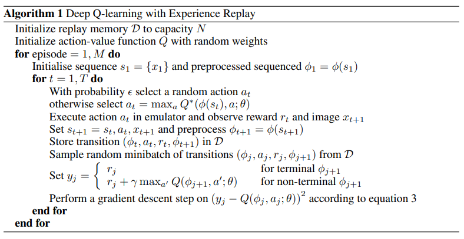
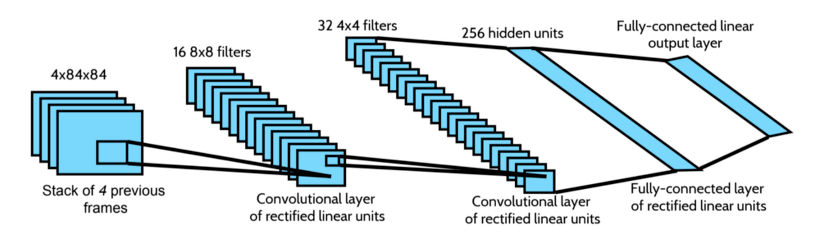
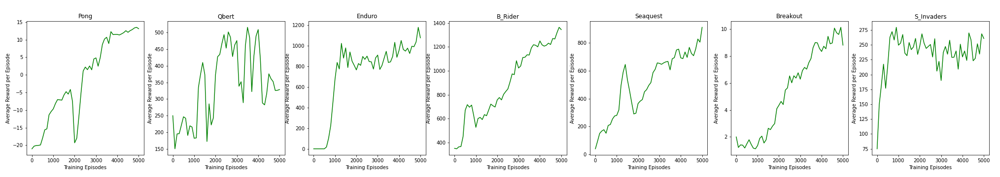
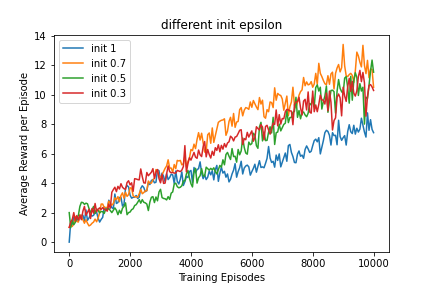
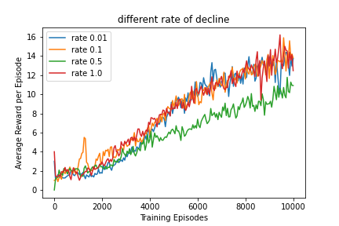

## INDEX
- [Project Purpose](#project-purpose)
- [Environment](#environment)
  * [How to set env](#how-to-set-env)
- [Implements](#implements)
  * [Preprocessing](#preprocessing)
  * [Algorithm](#algorithm)
  * [Model](#model)
- [Performance](#performance)

## Project Purpose


The ultimate goal of this project is to implement atari game player by reinforcement learning algorithm DQN.

## Environment
- OS : Window 11
- Python : 3.6
- Use Anaconda3
- Use Pytorch
- Use gym(Open AI)

### How to set env
1. You should install Anaconda3 -> [Anaconda download link](https://www.anaconda.com/)
2. Create Anaconda virtual env and turn on the env
```shell
# create env
conda create -n atari_openai python=3.6
# activate env
conda activate atari_test
```  
3. Install required pakages by conda
```shell
# pytorch(cpu or gpu)
conda install pytorch torchvision torchaudio cpuonly -c pytorch # if your pc use only cpu
conda install pytorch torchvision torchaudio cudatoolkit=11.1 -c pytorch -c conda-forge # gpu

# opencv 
conda install -c conda-forge opencv

# gym
conda install -c conda-forge gym

# atari_py
conda install -c conda-forge atari_py
```
4. Install Roms[(Roms download Link)](http://www.atarimania.com/rom_collection_archive_atari_2600_roms.html) and unzip a file
5. Enter the following command.
```shell
python -m atari_py.import_roms <path> # path ex) ~\Roms\ROMS
```


## Implements
*I referred to the [paper(Playing Atari with Deep Reinforcement Learning - DeepMind)](https://arxiv.org/abs/1312.5602).  

### Preprocessing
Raw Atari frame ,which are 210 X 160 pixel images with a 128 color palette, is computationally demanding.
So we should apply preprocessing for reducing the input dimensionality. The raw frames are preprocessed by converting RGB to gray-scale and
resizing it to a 84 x 84 pixel image using opencv library. 

It is implemented in [utils.py](./code/utils.py) as make_env function.
### Algorithm
  
It is implemented in [utils.py](./code/utils.py) as experience function.

### Model
  
It is implemented in [network.py](./code/networks.py).

## Performance
- Result of learning 7 atari games as DQN

- Hyper parameter epsilon tuning for BreakOut game<div>
  
  
</div>
